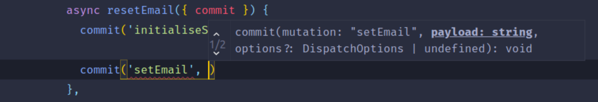

<h1 align="center" >🏦 Typed Vuex</h1>

A strongly-typed store accessor for vanilla Vuex

<a href="https://typed-vuex.roe.dev">Read documentation</a>

## Summary

This module provides a store accessor and helper type methods so you can access your vanilla Vuex store in a strongly typed way.

**Note**: This has been developed to suit my needs but additional use cases and contributions are very welcome.

[MIT License](./LICENSE) - Copyright &copy; Daniel Roe
