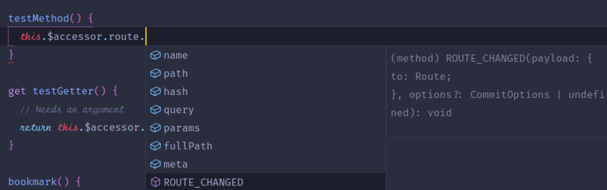

---
---

# Introduction

## Why another package?

Typing vanilla Vuex is complicated. Most people choose a class-based approach with Typescript decorators. However, this can cause issues, including:

- incompatibilities with Nuxt
- not being able to access `this.$axios` or the app/store instance from within actions
- too much boilerplate for accessors (such as initialising them in every component that uses them)
- slower performance

There are not many alternatives, and although Vuex provides limited type definitions for the store itself, it's complicated to access it in a type-safe way.

`nuxt-typed-vuex` was developed to address this problem, allowing you to write your store using vanilla Vuex code, and access it using a high-performance, strongly-typed accessor.

## Alternatives

If you would prefer a class-based approach, good options include [`vuex-module-decorators`](https://github.com/championswimmer/vuex-module-decorators) and [`vuex-class-component`](https://github.com/michaelolof/vuex-class-component).
